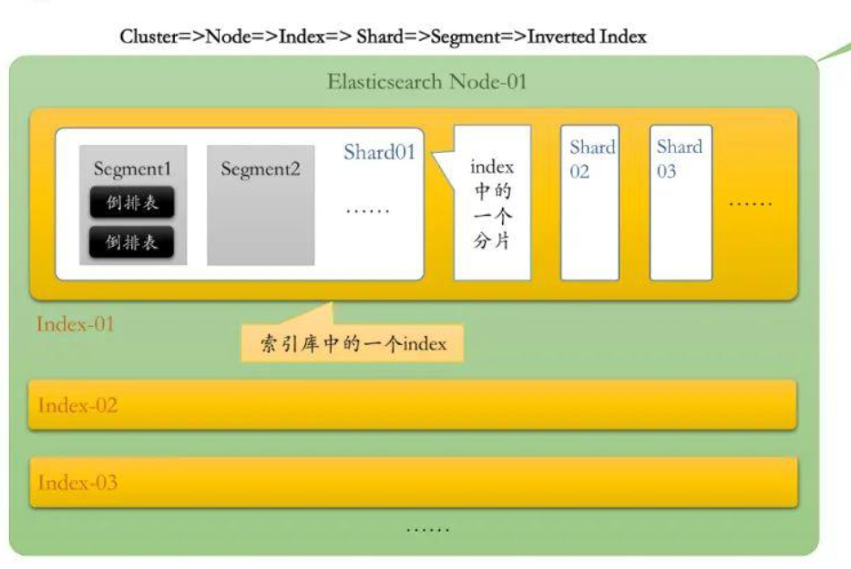

---
# 这是文章的标题
title: Elasticsearch基础
# 这是页面的图标
icon: file
# 这是侧边栏的顺序
order: 3
# 设置作者
author: CodeLong
# 设置写作时间
date: 2024-10-23
# 一个页面可以有多个分类
category:
  - Data
  - Elasticsearch
# 一个页面可以有多个标签
tag:
  - 基础
  - 使用指南
# 此页面会在文章列表置顶
sticky: true
# 此页面会出现在星标文章中
star: true
# 你可以自定义页脚
footer: 这是测试显示的页脚
# 你可以自定义版权信息
copyright: 无版权
---

<!-- more -->
Elasticsearch 是一个开源的、分布式的搜索引擎，广泛应用于日志分析、全文搜索、数据挖掘和实时分析等场景。它基于 Apache Lucene 构建，提供强大的搜索功能，并且能够处理大规模数据集，支持高效的全文检索和复杂的查询操作。它是 Elastic Stack（也称为 ELK Stack）中的核心组件之一，常与 Logstash（用于数据管道和日志处理）和 Kibana（用于数据可视化）一起使用。

## 1.基本概念和架构

- 分布式系统：Elasticsearch 是一个分布式系统，可以水平扩展以处理大量的数据。它将数据分为多个 shards（分片），并通过 replicas（副本）进行冗余存储，以确保数据的高可用性和容错性。

- 索引（Index）：在 Elasticsearch 中，数据是通过 索引 来组织的。索引是数据存储和搜索的基本单位。每个索引都包含多个 文档，文档是存储的数据记录，通常是 JSON 格式。

- 文档（Document）：文档是 Elasticsearch 中的基本数据单元。它是一个数据对象，通常是一个 JSON 格式的记录，包含多个字段，每个字段都是一个键值对。

- 字段（Field）：文档中的每个键值对，称为字段。字段可以是各种数据类型，如文本、数字、日期、地理位置等。

- 查询（Query）：Elasticsearch 提供了丰富的查询语言，可以执行基于文本的搜索、聚合操作、过滤查询等。常见的查询类型有 term 查询、match 查询、range 查询和bool 查询等。

## 2. Lucene

### 2.1 Lucene的起源


Elasticsearch 的诞生故事充满了偶然与机遇，它的起点源于 Shay Banon 个人生活中的一个需求，后来逐渐发展成一个全球广泛使用的搜索引擎。下面是对这个故事的扩展与进一步的解释：

1. 起源：Compass 和 Lucene
   
在2000年，Shay Banon 是一位待业的工程师，他的妻子对烹饪产生了浓厚兴趣，想要学习成为一名厨师。为了帮助她更好地查找菜谱，Shay Banon 决定开发一个简单的搜索引擎。最初，Shay 尝试使用 Lucene，一个由 Doug Cutting 开发的开源搜索库，它在文本搜索上非常强大，但由于其复杂的接口和设计，Shay 很快发现 Lucene 难以直接使用，且有许多坑。于是，Shay 基于 Lucene 开发了一个更容易使用的封装库，命名为 Compass（指南针）。这个工具可以帮助人们更方便地做搜索，尤其适用于类似菜谱的文本数据。

2. 从 Compass 到 Elasticsearch

随着 Compass 越来越受欢迎，Shay Banon 意识到这个工具不仅仅适用于菜谱搜索，还可以应用于更多需要高效搜索的场景。于是他决定对其进行重写和改进。Shay 找到了一份工作，加入了一家专注于高性能分布式系统的公司，这为他的灵感提供了新的触发点。基于他在高性能分布式环境中的经验，Shay 对 Compass 进行了彻底的重构，把它从一个简单的库，转变为一个独立的、分布式的 搜索引擎服务器。这个新的项目被命名为 Elasticsearch，意指一个易于横向扩展、易于部署的搜索引擎，专注于 高效、分布式 和 易于使用 的目标。

3. Elasticsearch 的发布和发展

2010年2月，Elasticsearch 发布了它的第一个版本。这个版本带来了一个 分布式、RESTful API 的搜索引擎，可以方便地进行 大数据量 的搜索和分析操作。相比 Lucene 和 Compass，Elasticsearch 提供了更高层次的抽象，简化了搜索引擎的部署和使用。它还采用了 JSON 格式的查询语言，使得开发者可以轻松地与搜索引擎进行交互。

随着时间的推移，Elasticsearch 不仅不断更新，而且越来越多的企业开始在生产环境中使用它。尤其是在大数据和实时搜索的场景中，Elasticsearch 凭借其分布式架构、扩展性以及强大的搜索功能，赢得了广泛的应用。

4. 开源与商业化

Elasticsearch 在不断演进的过程中，尽管推出了一些高级功能并将它们进行了商业化包装，但 Shay Banon 和 Elastic 公司 一直承诺 Elasticsearch 会保持开源且免费的。Elasticsearch 成为了 Elastic Stack（前称 ELK Stack）的一部分，结合 Logstash 和 Kibana，形成了一个完整的数据采集、处理、存储和可视化的解决方案。这使得 Elasticsearch 在 日志分析、实时搜索、数据分析、监控系统 等多个领域有了广泛的应用。

5. 快速更新与发展

从 1.0 版本到当前的 7.x 版本，Elasticsearch 的更新速度非常快。每个版本都带来了新的特性、性能改进和修复。在发展过程中，Elastic 公司逐步加强了对 机器学习、安全、数据可视化 等领域的支持，让 Elasticsearch 成为一个不仅限于搜索的 数据平台。尽管一些高级功能已经商业化（如商业支持、机器学习、商业数据可视化等），但 核心功能始终保持开源且免费的，保证了广泛的社区支持。

### 2.2 Elasticsearch的分层结构




Elasticsearch 的分层结构由多个组件和逻辑层次组成，确保其强大的分布式能力、实时搜索、以及快速数据索引的性能。以下是 Elasticsearch 的主要分层结构：

1. 集群（Cluster）

集群是由一个或多个节点（Node）组成的，具备相同 cluster.name 的节点集合。集群是 Elasticsearch 最顶层的逻辑组织，用于存储和管理所有的数据和索引。
每个集群有一个主节点，负责集群的协调、索引和管理。集群中的所有节点协同工作，处理分布式存储、搜索、负载平衡等操作。

2. 节点（Node）


节点是运行着 Elasticsearch 实例的单个服务器，它可以有多个角色，例如主节点（Master Node）、数据节点（Data Node）、协调节点（Coordinating Node）等。每个节点都有自己的名称，并承担特定的功能，帮助集群完成数据存储、索引和搜索。

常见的节点类型：

- 主节点（Master Node）：负责集群的元数据管理和任务协调，如分片分配、索引创建等。
- 数据节点（Data Node）：用于存储和处理数据，负责执行 CRUD（创建、读取、更新、删除）操作及复杂的搜索请求。
- 协调节点（Coordinating Node）：不存储数据，负责分发请求，聚合结果，为客户端提供统一的接口。
- 机器学习节点（Machine Learning Node）：专门执行机器学习任务，如异常检测和趋势分析。

3. 索引（Index）

索引是 Elasticsearch 中管理和存储数据的逻辑单元，相当于关系型数据库中的“表”。每个索引由一个唯一的名称标识，可以包含不同类型的数据集合。

每个索引都由多个分片（Shard）构成，分片是索引的物理分割方式，使得数据可以分布在集群的不同节点上，从而实现水平扩展。

索引的映射（Mapping）定义了数据的结构、字段类型等信息。

4. 分片（Shard）

分片是 Elasticsearch 中的最小数据存储单位，分片的设计使得索引可以被拆分成多个片段（分片），分布在不同的节点上。

分片分为 主分片（Primary Shard） 和 副本分片（Replica Shard）。主分片存储实际数据，而副本分片则用于冗余备份，确保数据高可用。

Elasticsearch 通过分片机制实现数据的分布式存储和水平扩展，并提供了自动分片和副本管理的功能。

5. 文档（Document）

文档是 Elasticsearch 中数据存储的基本单元，类似于关系数据库中的行（Row）。每条文档都是一个 JSON 格式的数据，包含一组键值对。

文档是根据索引中的映射存储的，映射定义了文档中的字段类型、分析方式等。每个文档在一个索引中拥有一个唯一的标识符_id。

6. 字段（Field）

字段是文档中的属性，相当于关系数据库中的列。字段的数据类型可以是文本、数值、布尔值、日期等。

每个字段可以通过不同的分析器进行处理，这样 Elasticsearch 可以实现灵活的搜索和分析需求。

::: tip MYSQL 和 Elasticsearch 

| **Elasticsearch (ES)**    | **MySQL**                         | **解释**                                                                          |
| ------------------------- | --------------------------------- | --------------------------------------------------------------------------------- |
| 集群（Cluster）           | 无直接对应                        | ES 中的集群是包含多个节点的逻辑集合，用于数据存储和负载分配，保证高可用和扩展性。 |
| 节点（Node）              | 数据库服务器（Instance）          | ES 中的节点相当于运行着 ES 实例的单个服务器，一个集群由多个节点组成。             |
| INDEX (索引)              | 表（Table）                       | ES 中的类型曾用于在一个索引内定义文档的“类”，但现已被弃用；相当于 MySQL 中的表。  |
| 文档（Document）          | 行（Row）                         | ES 中的文档是一条 JSON 格式的数据，存储在索引中，相当于 MySQL 表中的一行记录。    |
| 字段（Field）             | 列（Column）                      | ES 中的字段是文档的属性，类似于 MySQL 表中的列。                                  |
| 映射（Mapping）           | 表结构（Schema）                  | ES 中的映射定义了文档字段的结构和数据类型，相当于 MySQL 中的表结构。              |
| 主分片（Primary Shard）   | 主数据库分区（Primary Partition） | ES 中的主分片是索引的主要存储单元，类似于主分区的概念。                           |
| 副本分片（Replica Shard） | 备份（Replica）                   | ES 中的副本分片用于冗余备份和负载分摊，确保数据的高可用性，类似于数据库的备份。   |
| 分片（Shard）             | 无直接对应                        | ES 中的分片是存储数据的物理单元，用于数据分布和并行处理。                         |
| 查询 DSL（Query DSL）     | SQL 查询语言                      | ES 使用查询 DSL（基于 JSON）构建查询，而 MySQL 使用 SQL 语言查询数据。            |

:::

## 3. Mapping
在 Elasticsearch 中，Mapping 定义了索引中文档的字段及其数据类型、分析方式、存储方式等属性，类似于与Scheme。简单来说，Mapping 就是定义索引中文档结构的“蓝图”。通过 Mapping，Elasticsearch 知道如何解析和存储数据，也能高效地执行查询和聚合操作。

### 3.1 type

1. 字符串类型
- text

  - 说明：用于存储长文本，Elasticsearch **会对其进行分词（tokenization）**，适合用于全文搜索。
  - 常见用途：存储文章内容、评论、描述等需要全文搜索的字段。
  - 常用查询：match 查询。
::: tip
所有类型中只有text需要分词
:::
- keyword

  - 说明：用于存储精确值，不进行分词。适合存储短字符串、ID、标签等需要精确匹配的字段。
  - 常见用途：存储用户名、电子邮件、URL、标签等。
  - 常用查询：term 查询、range 查询、聚合等。

- text + keyword（组合字段）

  - 说明：将字段同时映射为 text 和 keyword 类型。通常使用 fields 属性来为同一字段提供多个视图。
  - 常见用途：对一个字段进行全文搜索和精确匹配。例如同时提供全文检索和标签过滤功能。
  ``` json
  "properties": {
    "title": {
      "type": "text", 
      "fields": {
        "keyword": {
          "type": "keyword"
        }
      }
    }
  }
  ```

1. 数值类型
- integer

  - 说明：用于存储 32 位整数。
  - 常见用途：存储年龄、数量、计数等整数值。
  - 常用查询：range 查询、聚合。

- long

  - 说明：用于存储 64 位整数。
  - 常见用途：存储大范围的整数，如用户 ID、计数器等。

- float

  - 说明：用于存储单精度浮动点数（32 位）。
  - 常见用途：存储价格、评分等数值数据。

- double

  - 说明：用于存储双精度浮动点数（64 位）。
  - 常见用途：存储更精确的浮动数值，常用于科学计算、货币等。

- scaled_float

  - 说明：用于存储带有小数位数的浮动点数，通常用于存储需要精确的小数数据（例如带有精度的价格）。
  - 常见用途：**存储带有高精度的小数数据，如价格、汇率等。**

3. 布尔类型

- boolean
  - 说明：用于存储布尔值（true 或 false）。
  - 常见用途：存储是否启用的状态、用户活跃状态、是否已完成等。

4. 日期类型
- date

   - 说明：用于存储日期和时间，可以指定自定义格式或使用默认的日期格式（strict_date_optional_time）。
   - 常见用途：存储时间戳、创建时间、修改时间等。
   - 常用查询：range 查询，按日期范围进行筛选。
   - 日期格式示例：
     - "yyyy-MM-dd"：例如 2024-04-15
     - "yyyy-MM-dd'T'HH:mm:ss.SSSZ"：例如 2024-04-15T08:00:00.000+0000

5. 对象类型

- object

  - 说明：用于存储 JSON 对象，可以**嵌套**多个属性。Elasticsearch 会把对象视作一组字段，允许对每个字段进行独立的索引和查询。
  - 常见用途：存储复杂的对象数据，如用户信息、商品信息、订单详情等
